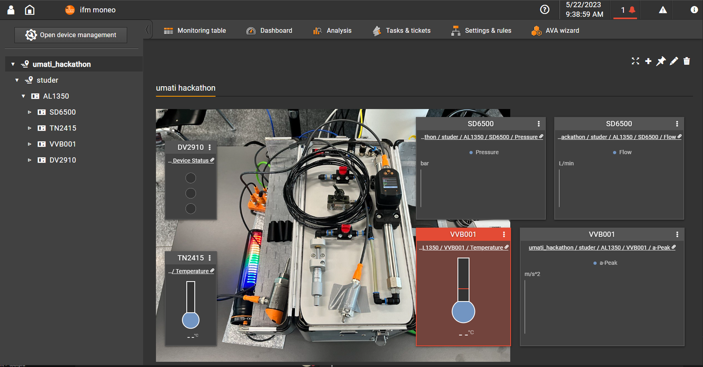
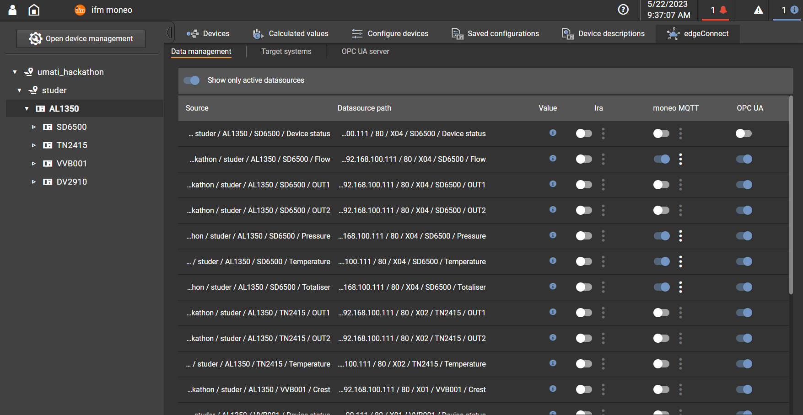

# Power Consumption 'Typical'

## System Setup

```plantuml
database "Profile Draft: OPC-UA\nFor Power Consumption\nManagement" as n0
node "Moneo" as n1 #Orange
rectangle "Collector" as n2 {
   node "OPC-UA Server" as n3 #TECHNOLOGY
   node "OPC-UA Client" as n4 #TECHNOLOGY
   node "Modbus/TCP Master" as n5 #TECHNOLOGY
   node "Mapping" as n11 #TECHNOLOGY
   node "REST Client" as n12 #TECHNOLOGY
}

node "Siemens PAC 2200\nEnergy" as n6
node "ifm IO-Link VV8001\nAcceleration" as n7
node "ifm IO-Link TN2415\nTemperature" as n8
node "ifm IO-Link DV2910\nStacklight" as n9
node "ifm IO-Link SD6500\nFlow" as n10

n0 <- n3
n3 <--n11
n11-->n4
n11-->n5
n11-->n12
n5 -->n6  : Modbus/TCP
n4 -->n1  : OPC-UA
n1 -->n7  : REST
n1 -->n8  : REST
n1 -->n9  : REST
n1 -->n10 : REST
n12 -->n9
n12 -->n7

```

## moneo Screenshots

 compressor dashboard   | datasource mapping
:----------------------:|:--------------------:
|

## Challenges

* Connecting devices via different channels
* Usage of the foundation stack needs a bit of experience in order have the server running as one would expect it
  * Loading the models needed to be implemented
  * Do NOT load the "Opc.Ua.NodeSet2.xml"! Otherwise the Machinetool Instance will not be loaded
  * Need to tell the server that a value has been updated

## Lessons learned
Experience in stack usage is needed.
Support for 'nodesetbased' implementation would be apreciated.

---

# OPC-UA Server On Ancient Heidenhain Controller


```plantuml

node "OPC-UA Server" as n0
node "Data Collector" as n1
node "HDH DNC" as n2
node "HDH Programming Station in VM" as n3

n0 --> n1 : C# in-proces
n1 --> n2 : C++ COM in-process
n2 --> n3 : HDH LSV2

```

## Challenges
Accessing data slightly different to recent

## Lessions Learned

* Periodically reboot your system ;-) (if using machine simulation in vm's)
