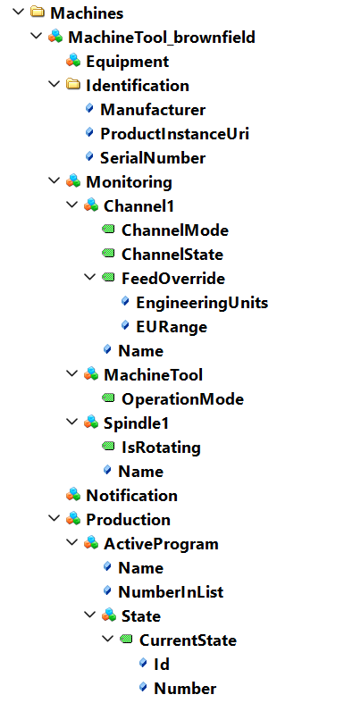
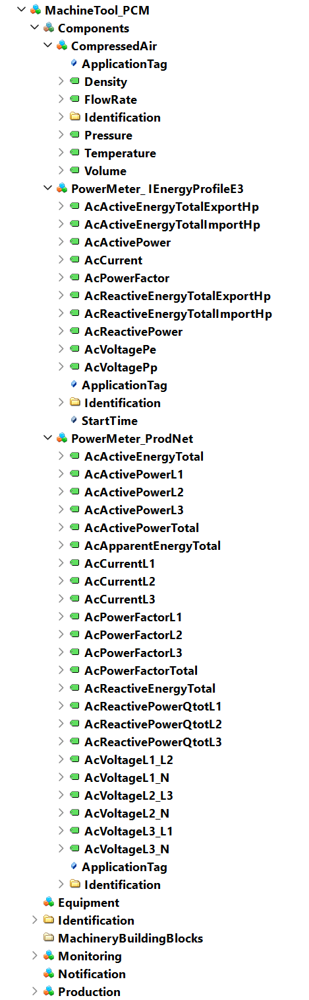

# Documentation

## Machine Tools information model

- [UA1.04](./InformationModel/UA1.04/) contains a machine tool model setup, based on UA 1.04 specification

- [UA1.05](./InformationModel/UA1.05/) contains a machine tool model setup, based on UA 1.05 specification

- [UA1.05_PCM](./InformationModel/UA1.05_PCM/) contains a machine tool model setup, based on UA 1.05 specification. Additionally to above it has two PowerMeters and a CompressedAir sensor based on Power Consumption Monitoring draft 0.6.

## References

- Online reference to the specification: <https://reference.opcfoundation.org/MachineTool/docs/>

- This [presentation](./Presentations/20221115_OPC40501-1_Introduction_Information_Model_UA4MT.pdf) contains a introduction to the information model in general. Updated version will be presented and shared at the hackathon.

## Sample instance for brownfield

## Sample instance for PowerComsumptionMonitoring

