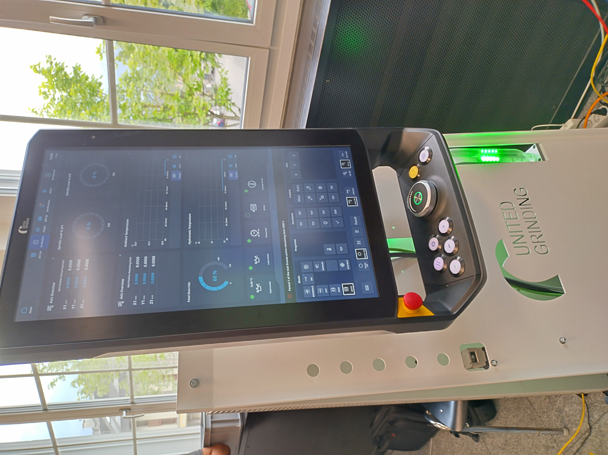
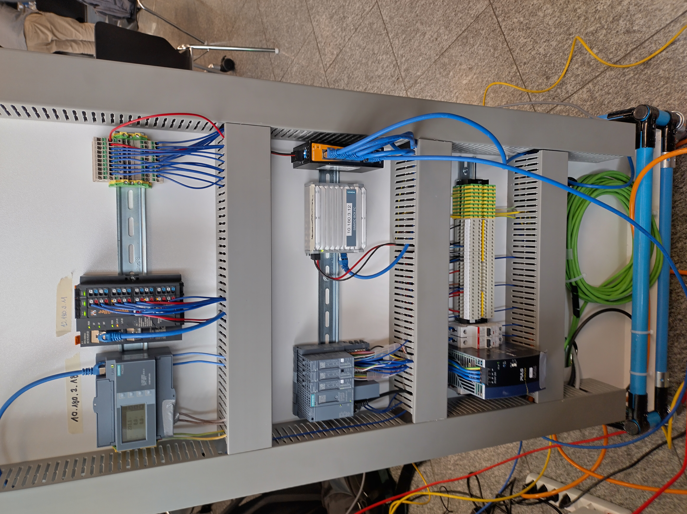
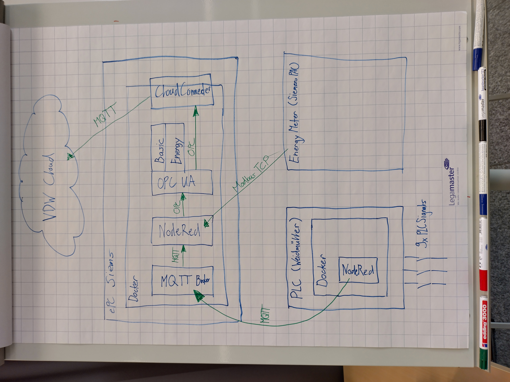
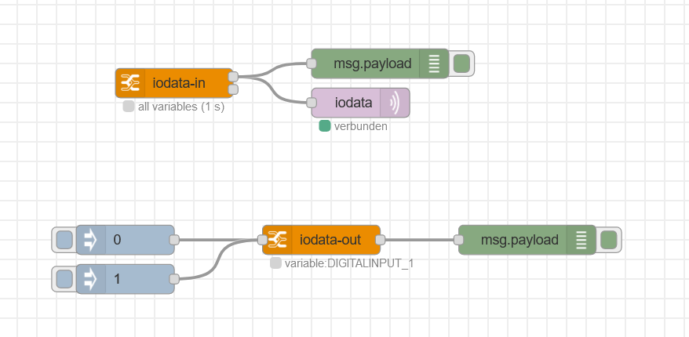
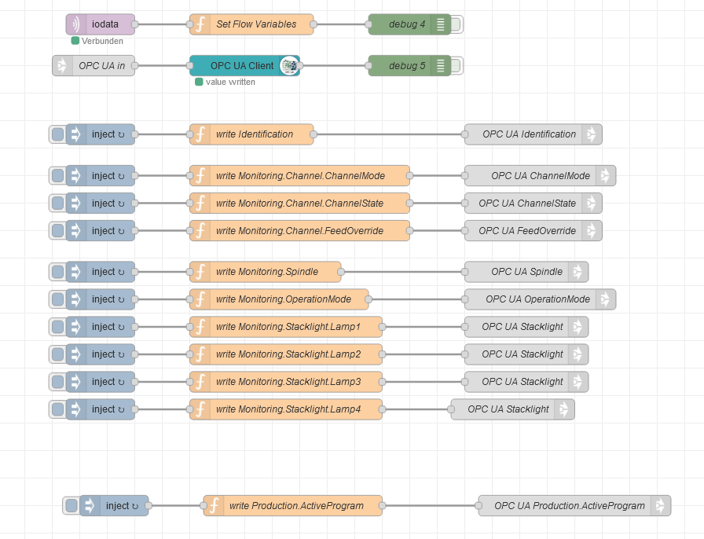
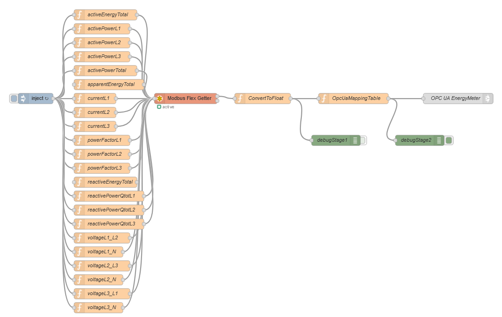

# UGG Testrack

## General

In this group we had a testrack provided by UGG.

Main components of the testrack:

- Panel to display information e.g. override value
- Stacklight
- Siemens PAC to measure power
- Weidmueller iot box
- Siemens PLC
- IPC Simatic

## Software and Architecture

The Siemens PLC was only to simulate a machine. The challenge was to receive information of a machine without a PLC and and API for that
So the inputs and outputs were monitored while changing values for e.g. spindle movement.

9 Signals were wired to the Weidmueller. There the I/Os could be read and were forwarded via MQTT to the MQTT broker of the IPC.

With NodeRED OPC UA the information was written in our OPC UA server. The server was deployed with Node.js and contained the basic server profile and the draft of energy consumption.

Finally a CloudConnector was sending the information of the OPC UA server to the VDW cloud environment via MQTT.

## Brownfield basic profile

Read wire input/outputs with the Weidmueller and send it to the IPC Broker.

Send information from MQTT broker to the OPC UA server.

## Energy

Read and process data of the Siemens PAC with ModbusTCP

Corresponding NodeRED flows are stored in the flows folder.
